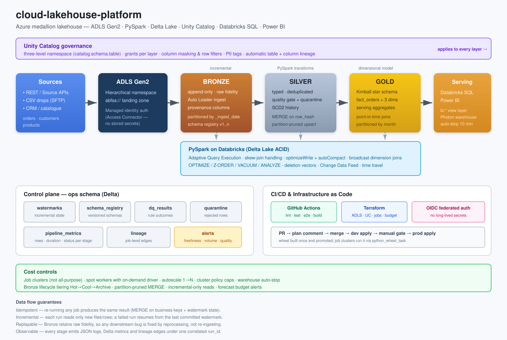

# Architecture



## The flow

```
Source APIs / CSV  →  ADLS Gen2  →  Bronze  →  PySpark  →  Silver
                                                              ↓
        Power BI  ←  Databricks SQL  ←  Gold  ←  Delta Lake  ─┘
```

Every arrow is a Delta transaction. Nothing moves between layers without a
commit, so a failure mid-pipeline leaves the lakehouse in its previous consistent
state rather than half-updated.

## Why medallion

The three layers exist because they answer three different questions, and mixing
them is what makes pipelines unmaintainable.

| Layer | Question it answers | Contract |
|---|---|---|
| **Bronze** | "What did the source actually send?" | Append-only, untyped, never modified. Replayable audit copy. |
| **Silver** | "What is true about the business?" | Typed, deduplicated, quality-enforced, one row per entity version. |
| **Gold** | "What does the business want to look at?" | Dimensional model, pre-aggregated, optimised for BI query patterns. |

The key discipline: **Bronze never casts and never filters.** A malformed price
lands in Bronze exactly as it arrived. It fails a *quality rule* in Silver, where
the failure is recorded and the row is quarantined. If Bronze had rejected it at
ingest, the row would be lost and nobody could reconstruct what the source sent.

## Layer detail

### Bronze — `src/lakehouse/jobs/ingest_bronze.py`

Reads only files newer than the last committed watermark. On Databricks that is
Auto Loader (`cloudFiles`), which maintains a RocksDB file index so a directory
with millions of files stays O(new files). Locally it degrades to a batch read
with `modifiedAfter`, giving identical semantics without a streaming runtime.

Every row gains provenance: `_ingest_timestamp`, `_ingest_date`, `_source_file`,
`_source_system`, `_run_id`, `_batch_id`. Partitioned by `_ingest_date`, which
bounds every incremental read and makes "replay just that batch" a partition filter.

**Watermark subtlety.** The Bronze watermark is a *file-discovery boundary*
captured before the read, not the maximum business `updated_at`. Those live in
different clock domains — a source system can backdate or future-date
`updated_at`, and comparing it against file modification time silently skips
files. Taking the boundary before the read also means a file landing mid-run is
picked up next time: at-least-once, never lost.

### Silver — `src/lakehouse/jobs/build_silver.py`

1. Read the Bronze slice newer than the Silver watermark
2. Conform: cast, trim, normalise case, derive money columns
3. Deduplicate: one row per key, newest by `updated_at` (a CDC batch routinely
   carries several versions of the same key; skipping this makes MERGE throw
   `DELTA_MULTIPLE_SOURCE_ROW_MATCHING_TARGET_ROW`)
4. Quality gate: evaluate the suite, quarantine failures, persist results
5. MERGE with `update_condition = t.row_hash <> s.row_hash`, so unchanged rows
   are not rewritten

`silver_customers` uses SCD2 — old versions are closed with `effective_to` and
`is_current = false` rather than overwritten, so revenue can be attributed to the
segment a customer had *at order time*.

### Gold — `src/lakehouse/jobs/build_gold.py`

A Kimball star: `fact_orders` at order-line grain, `dim_customer` (SCD2),
`dim_product` (SCD1), `dim_date` (generated), plus two serving aggregates.

Surrogate keys are `xxhash64` of the business key — deterministic, so the same
business key produces the same key on every rebuild and facts stay joinable after
a dimension refresh. `monotonically_increasing_id()` would break that.

The fact→customer join is a point-in-time band join on the validity window, with
the dimension broadcast. Unmatched members resolve to `-1` and are flagged with
`has_unknown_customer` — visible, not silently dropped.

## Control plane

The `ops` schema is the pipeline's own state, stored as Delta so it is queryable
from Databricks SQL alongside the business data.

| Table | Purpose |
|---|---|
| `watermarks` | Incremental position per (dataset, layer). Never moves backwards. |
| `schema_registry` | Append-only history of accepted schemas + the diff that produced each version. |
| `dq_results` | Per-rule outcome of every run — the input to the quality dashboard. |
| `quarantine` | Rejected rows with the failing rule names and the raw payload. |
| `pipeline_metrics` | Rows, duration, status per stage. Powers freshness and volume alerts. |
| `lineage` | Job-level edges (source object → target object) with run metrics. |

## Verified behaviour

Measured on the committed sample data (14 days, ~6k orders) with `make demo`:

| Stage | Read | Written | Quarantined | DQ pass rate |
|---|---|---|---|---|
| Bronze orders | 6,064 | 6,064 | — | — |
| Silver products | 200 | 197 | 3 | 98.50% |
| Silver customers | 540 | 497 | 3 | 99.40% |
| Silver orders | 6,064 | 5,848 | 201 | 96.68% |
| Gold `fact_orders` | — | 5,848 | — | — |
| Gold `agg_daily_sales` | — | 299 | — | — |

Re-running immediately reads **0 rows** and leaves every count unchanged — the
incremental and idempotency guarantees, verified rather than asserted.

Landing a new file with three previously unseen columns produced:

```
schema.registered  dataset=orders layer=bronze version=2
                   diff="+3 added (fulfilment_center, gift_wrap_flag, promotion_code)"
```

with no pipeline failure and no manual migration.
